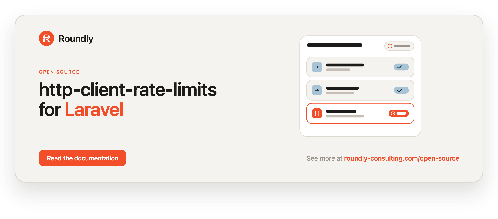

<!-- roundly-hero:start -->
<p align="center">
  <a href="https://roundly-consulting.com/open-source/docs/http-client-rate-limits-for-laravel?utm_source=github&utm_medium=readme&utm_campaign=open-source&utm_content=http-client-rate-limits-for-laravel">
    
  </a>
</p>
<!-- roundly-hero:end -->

# HTTP Client Rate Limits for Laravel

Rate limit outgoing requests made with Laravel's HTTP client. Wrap any
`Illuminate\Http\Client` request with a small Guzzle middleware that throttles how often
requests go out — `perSecond`, `perMinute`, or `perHour` — and transparently waits when a
limit is reached, so you never blow past a third-party API's quota.

- Per-second / per-minute / per-hour / per-day limits with a fluent factory.
- A one-line `Http::rateLimit(...)` macro and a `RateLimits` facade for a discoverable,
  IDE-autocompleted calling convention.
- **Named limiter profiles** — define a limit once in config and reference it by name:
  `Http::rateLimit('github')`.
- **Compound limits** — enforce several windows at once (e.g. 5/sec **and** 100/min); the
  strictest wins.
- **Max-wait cap** — `->maxWait(ms)` fails fast with a typed exception instead of blocking
  past a ceiling.
- **Response-header adaptive limiting** — `->adaptive()` reads `Retry-After` /
  `X-RateLimit-*` and self-tunes the store to the server's own budget.
- **Jitter / spread** — `->jitter(ms)` adds randomised wait to avoid thundering-herd
  alignment (the randomness source is injectable for deterministic tests).
- **Pre-flight inspection** — `remaining()`, `availableIn()`, `tooManyAttempts()` from the
  fluent surface.
- **Queue-aware deferrer** — `ReleaseDeferrer` releases a queued job back onto the queue
  (with the computed delay) instead of blocking the worker.
- **Testing fake** — `RateLimits::fake()` plus `assertDeferred()`, `assertAllowed()`,
  `assertNothingDeferred()` to test throttling without real sleeps or Redis.
- Pluggable **Store** (where request timestamps are kept) and **Deferrer** (how the wait is
  performed). Ships an in-process `InMemoryStore`, a `CacheStore` (shared via any cache the
  app already runs — no Redis required), a strictly-atomic `RedisStore`, a `DatabaseStore`
  (for apps with no Redis), and a millisecond `SleepDeferrer`.
- Scope a limit to an "owner" (e.g. an IP or account) so independent callers don't share a
  budget.
- Dispatches `RequestDeferred` / `RequestAllowed` events so you can log, meter, or alert on
  throttling.
- A `RetryAfter` helper to honour a server's `Retry-After` header alongside Laravel's own
  `->retry()`.
- Swap defaults per request, or globally via config — no required configuration to get started.

## Requirements

- PHP `^8.4`
- Laravel `^12.0 | ^13.0`

## Installation

```bash
composer require roundly-consulting/http-client-rate-limits-for-laravel
```

The service provider is auto-discovered. Optionally publish the config file:

```bash
php artisan vendor:publish --tag="http-client-rate-limits-config"
```

Only if you use the `DatabaseStore`, publish and run its migration:

```bash
php artisan vendor:publish --tag="http-client-rate-limits-migrations"
php artisan migrate
```

## Configuration

The published file lives at `config/http-client-rate-limits.php`:

```php
return [
    // Named limiter profiles referenced by string: Http::rateLimit('github').
    // Each is ['rate' => int, 'per' => second|minute|hour|day] plus optional
    // 'by', 'trim', 'max_wait' (ms), 'jitter' (ms), 'adaptive' (bool).
    'limiters' => [
        // 'github' => ['rate' => 5, 'per' => 'second', 'by' => null],
    ],

    // Default Store used by RateLimit::make()/perSecond()/perMinute()/perHour().
    // Must implement RoundlyConsulting\HttpClientRateLimits\Store\Store.
    'store' => env('HTTP_CLIENT_RATE_LIMITS_STORE', InMemoryStore::class),

    // Default Deferrer used to read "now" and to pause when a limit is hit.
    // Must implement RoundlyConsulting\HttpClientRateLimits\Deferrer\Deferrer.
    'deferrer' => env('HTTP_CLIENT_RATE_LIMITS_DEFERRER', SleepDeferrer::class),

    // Cache store name (from config/cache.php) and key prefix used by the CacheStore.
    'cache_store' => env('HTTP_CLIENT_RATE_LIMITS_CACHE_STORE'),
    'cache_prefix' => env('HTTP_CLIENT_RATE_LIMITS_CACHE_PREFIX', 'http-client-rate-limits'),

    // Redis connection name (from config/database.php) used when the store is the RedisStore.
    'redis_connection' => env('HTTP_CLIENT_RATE_LIMITS_REDIS_CONNECTION', 'default'),

    // Dispatch RequestDeferred / RequestAllowed events when the limiter runs.
    'events_enabled' => env('HTTP_CLIENT_RATE_LIMITS_EVENTS_ENABLED', true),
];
```

| Key | Type | Default | Env | Purpose |
|---|---|---|---|---|
| `limiters` | `array<string, array>` | `[]` | — | Named limiter profiles referenced by string. |
| `store` | `class-string<Store>` | `InMemoryStore::class` | `HTTP_CLIENT_RATE_LIMITS_STORE` | Default store for new rate limits. |
| `deferrer` | `class-string<Deferrer>` | `SleepDeferrer::class` | `HTTP_CLIENT_RATE_LIMITS_DEFERRER` | Default deferrer for new rate limits. |
| `cache_store` | `?string` | `null` | `HTTP_CLIENT_RATE_LIMITS_CACHE_STORE` | Cache store name used by `CacheStore` (`null` = default). |
| `cache_prefix` | `string` | `'http-client-rate-limits'` | `HTTP_CLIENT_RATE_LIMITS_CACHE_PREFIX` | Key prefix used by `CacheStore`. |
| `redis_connection` | `string` | `'default'` | `HTTP_CLIENT_RATE_LIMITS_REDIS_CONNECTION` | Redis connection the `RedisStore` uses. |
| `events_enabled` | `bool` | `true` | `HTTP_CLIENT_RATE_LIMITS_EVENTS_ENABLED` | Dispatch throttling events. |

A configured `store`/`deferrer` that does not implement the matching contract throws a typed
`InvalidStoreException` / `InvalidDeferrerException` (both extend `RateLimitException`) when a
rate limit is created.

## Usage

### Apply a rate limit to the HTTP client (one line)

The package adds a `rateLimit()` macro to Laravel's HTTP client — the quickest way to throttle
outgoing calls:

```php
use Illuminate\Support\Facades\Http;

// Integer shorthand = N requests per minute.
$response = Http::rateLimit(30)->get('https://api.example.com/orders');
```

When the limit is reached, the middleware waits the exact time until the next request is
allowed, then proceeds — you simply get your response a little later.

Pass a `RateLimit` or a `Limit` to pick a different window, and `by:` to scope the budget to
an owner:

```php
use RoundlyConsulting\HttpClientRateLimits\RateLimit;

Http::rateLimit(RateLimit::perSecond(5))->get('https://api.example.com/things');
Http::rateLimit(RateLimit::perDay(10_000))->get('https://api.example.com/report');

// Each owner gets its own budget (e.g. per account or outbound IP).
Http::rateLimit(30, by: 'acct-1')->get('https://api.example.com/orders');
```

### The `RateLimit` middleware directly

`RateLimit` is a Guzzle middleware, so you can also attach it with `Http::withMiddleware()`:

```php
$response = Http::withMiddleware(RateLimit::perSecond(5))
    ->get('https://api.example.com/things');
```

### Available factories

```php
new RateLimit(Limiter $limiter);                 // build it yourself
RateLimit::make(Limit $limit);                   // from a Limit value object
RateLimit::perSecond(int $maxAttempts = 1);      // N requests per second
RateLimit::perMinute(int $maxAttempts = 1);      // N requests per minute
RateLimit::perHour(int $maxAttempts = 1);        // N requests per hour
RateLimit::perDay(int $maxAttempts = 1);         // N requests per day
```

Each returned `RateLimit` is fluent: `->by(...)`, `->alongside(...)`, `->maxWait(...)`,
`->jitter(...)`, `->adaptive()`, `->remaining()`, `->availableIn()`, `->tooManyAttempts()`.

The `RateLimits` facade adds `profile(string $name)` and `compound(array $limits)`.

### Named limiter profiles

Define reusable limits once in `config/http-client-rate-limits.php` and reference them by
name from anywhere:

```php
// config/http-client-rate-limits.php
'limiters' => [
    'github' => ['rate' => 5, 'per' => 'second'],
    'billing' => ['rate' => 100, 'per' => 'minute', 'by' => 'tenant-1', 'jitter' => 50],
],
```

```php
Http::rateLimit('github')->get('https://api.github.com/user');
```

Referencing a name that isn't defined throws `UnknownLimiterProfileException`. Each profile
array accepts `rate`, `per`, and the optional `by`, `trim`, `max_wait`, `jitter`, and
`adaptive` keys.

### Compound limits (several windows at once)

Pass an array of limits to enforce them all on one request; the limiter defers to the
strictest and records a hit on every window when the call is allowed:

```php
use RoundlyConsulting\HttpClientRateLimits\RateLimit;

Http::rateLimit([RateLimit::perSecond(5), RateLimit::perMinute(100)])
    ->get('https://api.example.com/things');

// Or fluently, alongside the primary window:
$middleware = RateLimit::perSecond(5)->alongside(RateLimit::perMinute(100));
```

### Fail fast with a max-wait cap

When you'd rather error than block for too long, cap the wait. A computed defer above the
ceiling throws `RateLimitExceededException` (extends `RateLimitException`) instead of sleeping:

```php
Http::rateLimit(RateLimit::perHour(10)->maxWait(5_000)) // milliseconds
    ->get('https://api.example.com/report');
```

### Jitter / spread

Add randomised jitter to defers so many workers don't all wake at the same instant:

```php
Http::rateLimit(RateLimit::perMinute(30)->jitter(50)) // ± up to 50ms
    ->get('https://api.example.com/orders');
```

The randomness source is the injectable `Randomizer` contract — swap it in a `Limiter` for
deterministic tests.

### Adaptive limiting (honour the server's own budget)

Opt in with `->adaptive()` and the limiter reads `Retry-After` and `X-RateLimit-Remaining` /
`X-RateLimit-Reset` from each response, recording a penalty in the store so the next request
waits exactly as long as the server asked:

```php
Http::rateLimit(RateLimit::perSecond(20)->adaptive())
    ->get('https://api.example.com/things');
```

### Pre-flight inspection

Ask the limiter about the current state before sending — without recording a hit:

```php
use RoundlyConsulting\HttpClientRateLimits\Facades\RateLimits;

$limit = RateLimits::perMinute(30)->by('acct-1');

$limit->remaining();        // requests still allowed in the window
$limit->availableIn();      // ms until the next request is allowed (0 = now)
$limit->tooManyAttempts();  // bool — is the window exhausted right now?
```

### The `RateLimits` facade

For building or inspecting a limit without the HTTP client, use the `RateLimits` facade (it
resolves the container-bound manager, so the configured store/deferrer apply):

```php
use RoundlyConsulting\HttpClientRateLimits\Facades\RateLimits;

$limit = RateLimits::perHour(60)->by('203.0.113.10');

$at    = $limit->getDeferrer()->timestamp();
$delay = $limit->delayUntilNextRequestInMs($at); // 0 = send now, else wait this many ms
```

### Scope a limit to an owner

Useful when a single quota is shared across servers/accounts and you want each owner tracked
separately (e.g. per outbound IP):

```php
$middleware = RateLimit::perHour(60)->by('203.0.113.10');

Http::withMiddleware($middleware)->get('https://api.example.com/orders');
```

### Inspect the limit without sending a request

`RateLimit` forwards calls to the underlying `Limit`/`Limiter`, so you can ask how long you'd
have to wait before the next call is allowed:

```php
$middleware = RateLimit::perHour(6);

$at    = $middleware->getDeferrer()->timestamp();
$delay = $middleware->delayUntilNextRequestInMs($at); // 0 = send now, else wait this many ms

$middleware->isOverMaxAttempts(7); // true
```

### Swap the store / deferrer per instance

```php
use RoundlyConsulting\HttpClientRateLimits\Store\RedisStore;

$middleware = RateLimit::perMinute(30);

$middleware->setStore(new RedisStore('cache')); // share limits across processes via Redis
$middleware->setDeferrer($myDeferrer);
```

### Change the defaults globally

In a service provider (or via the config file above):

```php
use RoundlyConsulting\HttpClientRateLimits\RateLimit;
use RoundlyConsulting\HttpClientRateLimits\Store\RedisStore;

RateLimit::use(
    defaultStore: new RedisStore('cache'),
    defaultDeferrer: new MyDeferrer(),
);
```

Every `RateLimit` created afterwards uses those defaults. Call `RateLimit::use()` with no
arguments to reset back to the config-driven defaults.

### Stores

- **`InMemoryStore`** (default) — keeps request timestamps in process memory. Great for a
  single worker/CLI run; not shared between processes.
- **`CacheStore`** — shares limits across processes using whatever cache the app already runs
  (file, database, memcached, array, …) — no Redis required. The read-modify-write is wrapped
  in an atomic lock when the cache store supports one; otherwise it's best-effort. Configure
  it with the `cache_store`/`cache_prefix` config keys, or instantiate directly:

  ```php
  use RoundlyConsulting\HttpClientRateLimits\Store\CacheStore;

  $store = new CacheStore(store: 'redis', prefix: 'http-client-rate-limits');
  ```

- **`RedisStore`** — keeps timestamps in a sorted set so limits are shared across processes
  and servers, with strict atomicity. Pass the Redis connection name (defaults to `default`):

  ```php
  use RoundlyConsulting\HttpClientRateLimits\Store\RedisStore;

  $store = new RedisStore('default');
  ```

- **`DatabaseStore`** — shares limits through a database table (Eloquent, never the `DB`
  facade) for apps that run only a file/database cache and have no Redis. Select it with
  `'store' => DatabaseStore::class` and publish/run its migration (see Installation):

  ```php
  use RoundlyConsulting\HttpClientRateLimits\Store\DatabaseStore;

  $store = new DatabaseStore;
  ```

Both the `CacheStore` and `RedisStore` self-trim entries older than the largest supported
window so long-lived keys stay bounded. Every store also records server-imposed penalties for
adaptive limiting via `penalizeUntil()` / `penalizedUntil()`. Write your own by implementing
`RoundlyConsulting\HttpClientRateLimits\Store\Store`.

### Deferrers

- **`SleepDeferrer`** (default) — reads the current time in milliseconds and pauses with
  `Illuminate\Support\Sleep` (fakeable in tests).
- **`ReleaseDeferrer`** — for use inside a queued job: instead of blocking the worker, it
  releases the job back onto the queue with the computed delay and throws
  `JobReleasedException` to unwind the current attempt. Construct it with the job and opt in
  via `RateLimits::usingDeferrer(...)`:

  ```php
  use RoundlyConsulting\HttpClientRateLimits\Deferrer\ReleaseDeferrer;
  use RoundlyConsulting\HttpClientRateLimits\Facades\RateLimits;

  // inside a queued job's handle(), $this uses Illuminate\Queue\InteractsWithQueue
  $rateLimit = RateLimits::usingDeferrer(new ReleaseDeferrer($this))->perSecond(5);

  Http::withMiddleware($rateLimit)->get('https://api.example.com/things');
  ```

Write your own by implementing
`RoundlyConsulting\HttpClientRateLimits\Deferrer\Deferrer`.

### Events

When `events_enabled` is on (the default), the limiter dispatches:

- **`RequestDeferred`** — `string $key`, `int $delayMs`, `int $hitsInWindow`, `Timespan $timespan` —
  right before a request is paused because the budget is exhausted.
- **`RequestAllowed`** — `string $key`, `int $hitsInWindow`, `Timespan $timespan` — after a
  request is recorded and allowed through.

Listen for them to log, chart, or alert on throttling:

```php
use Illuminate\Support\Facades\Event;
use RoundlyConsulting\HttpClientRateLimits\Events\RequestDeferred;

Event::listen(function (RequestDeferred $event): void {
    logger()->warning('Throttled outbound request', [
        'key' => $event->key,
        'delay_ms' => $event->delayMs,
        'window' => $event->timespan->value,
    ]);
});
```

Set `events_enabled` to `false` for the lowest possible overhead.

### Reacting to 429 / Retry-After

This package *paces* outgoing requests proactively. To also react to a server's own signals,
use `->adaptive()` (above) or combine the middleware with Laravel's own `->retry()` and the
`RetryAfter` helper to honour a `429 Too Many Requests` / `Retry-After` response:

```php
use RoundlyConsulting\HttpClientRateLimits\RetryAfter;

Http::rateLimit(RateLimit::perMinute(60))
    ->retry(3, throw: false, sleepMilliseconds: fn ($attempt, $exception) =>
        (RetryAfter::seconds($exception) ?? $attempt) * 1000)
    ->get('https://api.example.com/things');
```

`RetryAfter::seconds()` accepts a `Response` or a `RequestException`, parses both the
delta-seconds and HTTP-date forms of the header, and returns `null` when it's absent or
unparseable.

### Testing your own code

Swap the manager for a recording fake so your suite can assert on throttling without real
sleeps or Redis:

```php
use RoundlyConsulting\HttpClientRateLimits\Facades\RateLimits;

$fake = RateLimits::fake();

Http::rateLimit(1, by: 'acct-1')->get('https://api.example.com/one');
Http::rateLimit(1, by: 'acct-1')->get('https://api.example.com/two');

$fake->assertDeferred('acct-1');   // a request for this key was throttled
$fake->assertAllowed();            // at least one request went through
// $fake->assertNothingDeferred(); // would fail here
```

`fake()` returns a `RateLimitsFake` exposing `assertDeferred(?string $key)`,
`assertAllowed(?string $key)`, `assertNothingDeferred()`, and the shared `store()` /
`deferrer()` for finer-grained assertions.

## Integrates with

- **[enums-for-laravel](https://github.com/roundly-consulting/enums-for-laravel)** — the
  `Timespan` enum uses the shared `RoundlyConsulting\Enums\Helpers` trait, so it exposes the
  full enum toolkit alongside its domain methods (`fromValue()`, `lengthInMs()`):

  ```php
  use RoundlyConsulting\HttpClientRateLimits\Enums\Timespan;

  Timespan::values();          // ['second', 'minute', 'hour', 'day']
  Timespan::labels();          // ['Second', 'Minute', 'Hour', 'Day']
  Timespan::options();         // list of {value, label, name} option DTOs
  Timespan::toOptions();       // value => label map for <select> inputs
  Timespan::validationRule();  // 'in:second,minute,hour,day'

  Timespan::Hour->label();     // 'Hour'
  Timespan::fromName('Hour');  // Timespan::Hour
  ```

- **[package-toolkit-for-laravel](https://github.com/roundly-consulting/package-toolkit-for-laravel)** —
  bootstraps the service provider (config merge/publish, migration loading/publishing) and adds a
  `php artisan about` section reporting the active store, deferrer, limiter-profile count, and
  whether events are enabled:

  ```bash
  php artisan about --only=http-client-rate-limits
  ```

## Testing

```bash
composer test
```

The Redis-backed tests run automatically when a Redis connection is reachable and skip
otherwise.

## Changelog

Please see [CHANGELOG](CHANGELOG.md) for what has changed recently.

## License

The MIT License (MIT). Please see [License File](LICENSE.md) for more information.
